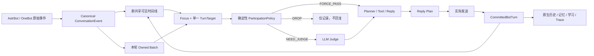

# AstrMai 群聊上下文架构优化路线图（2026-07-31）

状态：**本地实施与自动化验收完成，待生产灰度** ｜ 范围：OPT-17～OPT-24 ｜ 输入：AngelHeart、Group Chat Plus、Proactive Chat、MaiBot 四份专项报告与 AstrMai 当前源码复核

> 2026-07-31 收口：规范事件、冻结目标、发送后提交、可信上下文边界、参与策略、群共享连续性、人物记忆白名单、主动调度、回放与迁移均已落地。全量回归为 `1984 passed, 1 skipped, 1 deselected`。本地未执行服务器部署、生产 cutover、24 小时 shadow 指标采集或容器回退演练。

## 目标

本阶段不是重写 AstrMai，也不是照搬任一参考项目。目标是在保留现有 Attention、Planner、Memory、Tool、Vision 和 Reply 链路的前提下，统一群聊运行时的三类事实：

1. **输入事实唯一**：谁在什么会话、针对谁、回复哪条消息、携带哪些媒体和互动信号。
2. **本轮目标唯一**：本轮机器人正在回应谁、依据哪些消息、处于哪个话题代次。
3. **输出事实唯一**：只有实际发送成功的文本、分段和消息 ID 才能进入历史、记忆、学习和连续性状态。

最终希望机器人在高活跃群聊中同时做到：

- 看见完整公共时间线，但不会把甲的关系、情绪和称呼套给乙。
- 短消息能够自然承接上一轮，不因中间插入无关消息就失忆。
- 对共同话题保持连续感，但话题切换后及时失效旧推断。
- 主动发言、等待、忽略、互动和工具调用都能解释其触发依据。
- 外部插件注入、引用消息、图片和系统互动不会破坏身份归属。
- 模型草稿、发送失败内容和部分发送内容不会污染后续上下文。

## 四份报告的可吸收部分

| 来源 | 适合吸收 | 不直接照搬 |
|---|---|---|
| AngelHeart | 批次级强唤醒聚合、短期参与迟滞、结构化上一轮 Bot 输出、话题/参与者切换时使旧观察失效、派生参与阶段 | 扁平 transcript、独立四状态业务状态机 |
| Group Chat Plus | actor/target/bot ID 显式化、公共可见窗口与本轮自有批次分离、发送后提交、媒体占位、外部插件上下文来源标记 | monkey patch、依赖昵称做身份、并行维护第二份不可校验历史 |
| Proactive Chat | 用户活动与 Bot 回复双水位、持久化下次唤醒时间、主动任务 generation 取消、真实 chat kind、未应答次数上限、失败静默 | 绕过正常 Attention/Planner 的独立回复链 |
| MaiBot | 群共享连续时间线、消息身份、单一 TurnTarget、动作代数、LLM Judge 前的可解释参与评分、活跃参与者白名单、参与者感知摘要 | 整套替换 AstrMai Runtime、复制 FocusManager |

## 当前源码基线

### 已有可复用能力

- `event_normalizer.py` 已能提取 sender、@Bot、回复 Bot、图片引用和 rich text。
- `group_dialogue_store.py` 的 `DialogueSegment` 已包含 `event_id`、`speaker_id`、`topic_epoch`、因果父消息、来源消息和 provenance。
- `decision_router.py` 已有 `FORCE_PASS / DROP / NEED_JUDGE` 三态前置过滤雏形。
- `chat_runtime_coordinator.py` 已有 generation、活动序列、任务取消和发送 claim。
- `reply_artifact_builder.py` 已能识别部分发送并收集实际 outbound message IDs。
- `reply_service.py` 已在实际发送后使用 `persistable_text` 同步原生历史和记忆。

### 当前断裂点

1. `NormalizedEvent`、`DialogueSegment`、SQL `MessageLog` 与 trace 的字段口径没有统一。
2. `FocusThreadContext` 没有不可变的结构化 `TurnTarget`，Planner 和历史写入仍会重新推断目标。
3. `planner.py` 在发送前就把模型草稿写入 `group_dialogue_store`；实际发送结果稍后才由 Reply 层得知。
4. `MessageLog` 缺少稳定 event ID、target、@列表、topic epoch、causal/provenance 等群聊必要字段。
5. 主动唤醒使用 `last_reply_time` 判断沉默，未区分真实用户活动和 Bot 自己的可见回复。
6. `MessageRenderer` 仍以 `昵称: 文本` 为主，缺少统一的不可信边界和显式目标描述。
7. 群聊等待作用域实现存在可疑反转：配置启用 thread wait 时读取 chat 级信息，关闭时反而传 thread ID，必须先用测试定性。
8. 记忆与关系注入尚未由当前活跃参与者白名单严格约束。

## 目标架构

### 不变量

1. 每个入站事件有稳定 `event_id`；同一会话内重复事件幂等。
2. 每轮只有一个 `TurnTarget`，Focus 确定后下游只读，不再按昵称或最近发言者重猜。
3. 群聊时间线共享；用户关系、画像和长期记忆按稳定 user ID 隔离。
4. 当前发言者、明确目标、@对象、引用对象和活跃话题参与者构成当轮 actor whitelist。
5. Planner 输出只是草稿；`CommittedBotTurn` 才是写入后续系统的 Bot 事实。
6. 部分发送只提交已发送分段；发送失败不提交可见回复。
7. derived context 一律标记为不可信资料，不能伪装系统指令。
8. 主动任务在任意真实用户新消息到达后失效；发送前必须再次核验 generation。

## 工作流拆分

| 编号 | 工作流 | 优先级 | 主要输出 | 依赖 |
|---|---|---|---|---|
| [OPT-17](OPT-17-canonical-conversation-event.md) | 规范会话事件与持久化兼容 | P0 | 单一事件语义、稳定 ID、双写迁移 | 无 |
| [OPT-18](OPT-18-turn-target-and-actor-attribution.md) | 单一 TurnTarget 与人物归属 | P0 | 目标契约、证据链、actor whitelist 基础 | OPT-17 |
| [OPT-19](OPT-19-committed-reply-writeback.md) | 发送后提交与 Bot 输出真源 | P0 | CommittedBotTurn、幂等写回、移除草稿污染 | OPT-17、18 |
| [OPT-20](OPT-20-participation-attention-policy.md) | 群聊参与判定与短期迟滞 | P1 | 可解释 prefilter、参与阶段、Judge 减负 | OPT-17、18 |
| [OPT-21](OPT-21-proactive-scheduling-consistency.md) | 主动调度一致性 | P1 | 双水位、持久 due、generation 取消 | OPT-17～19 |
| [OPT-22](OPT-22-context-rendering-and-plugin-bridge.md) | 上下文渲染边界与插件桥 | P1 | 统一 renderer、不可信边界、官方扩展桥 | OPT-17、18 |
| [OPT-23](OPT-23-group-continuity-and-memory-whitelist.md) | 群共享连续性与人物记忆隔离 | P0 | 参与者摘要、关系白名单、读写连续性 | OPT-17～19、22 |
| [OPT-24](OPT-24-context-architecture-regression-and-rollout.md) | 回放、观测、迁移与灰度 | P0 | 事故样本、shadow/cutover、上线指标 | 全部 |

## 推荐实施顺序

1. **底座**：OPT-17 → OPT-18。
2. **修正事实写入**：OPT-19。
3. **统一展示与边界**：OPT-22。
4. **降低错误参与和 Judge 成本**：OPT-20。
5. **恢复群聊连续性且隔离人物**：OPT-23。
6. **修主动消息调度**：OPT-21。
7. **全链回放与灰度切换**：OPT-24。

OPT-17～19 必须优先完成。若先调 prompt、记忆 top-k 或 Judge 文案，仍会把错误人物和未发送草稿送入模型，只能暂时掩盖问题。

## 总体验收指标

### 正确性

- direct @、回复 Bot、戳 Bot 漏回复率不得上升。
- 群聊人物误绑定事故在固定回放集上为 0。
- 发言者、目标用户、引用用户和 Bot 自身四类身份在 trace 中可逐轮解释。
- 发送失败和未发送草稿不得出现在后续共享历史、记忆或学习候选中。
- 部分发送时，后续模型只看到实际成功发送的部分。

### 连续性

- 用户短承接语（“不对”“然后呢”“我没有”）能绑定正确上一轮 Bot 目标。
- 话题有效期内能够恢复参与者和未决问题；话题切换后不再强行延续旧剧情。
- 群共享事件不丢失，用户关系与记忆不跨 ID 扩散。

### 性能

- 明显无关消息进入 LLM Judge 的比例下降，强唤醒路径不增加额外 LLM 调用。
- 新规范事件与提交写回的 P95 本地开销不超过 10ms（不含数据库外部依赖）。
- context 渲染字符数不高于现有基线，重复块数量下降。

### 可观测性

每轮至少可查询：

- `event_id`、`source_event_ids`、`topic_epoch`
- `actor_ids`、`turn_target`、`target_evidence`
- `participation_prefilter`、`judge_action`
- `reply_plan_id`、`commit_status`、`outbound_message_ids`
- `committed_visible_text_hash`、`partial_send`
- `memory_actor_whitelist`、被抑制的跨人物候选数量
- 主动任务的 `due_at`、`generation`、取消原因

## 非目标

- 不替换 AstrBot 事件总线。
- 不复制 MaiBot 的完整 Runtime 或 FocusManager。
- 不新建第二套群聊历史与现有 `DialogueSegment` 长期并行。
- 不用硬编码昵称解决身份问题。
- 不用 monkey patch 接管其他插件。
- 不在本阶段改变 Persona 业务语义、Vision 模型选择或工具数量。

## 回退原则

- 所有新读路径先 shadow，旧路径保留一版发布周期。
- 数据迁移只追加字段或新表，不直接删除旧 `MessageLog`。
- ParticipationPolicy 先仅记录，指标稳定后再切断 Judge。
- CommittedBotTurn 写回失败时保留 outbox/repair 记录，不回退到发送前写草稿。
- 每个 OPT 独立提交；回退按 OPT-24 → 21/23/20/22 → 19 → 18 → 17 的逆依赖顺序执行。
