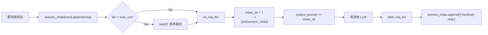
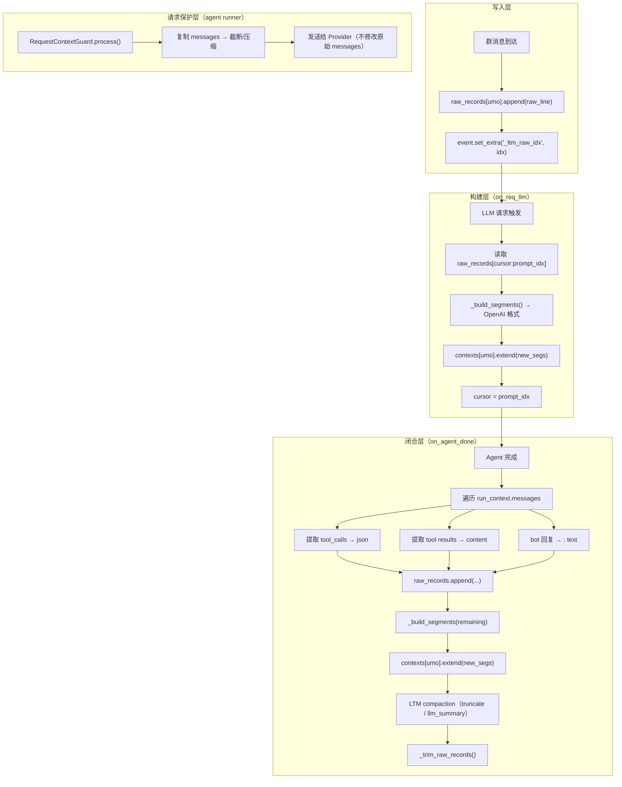
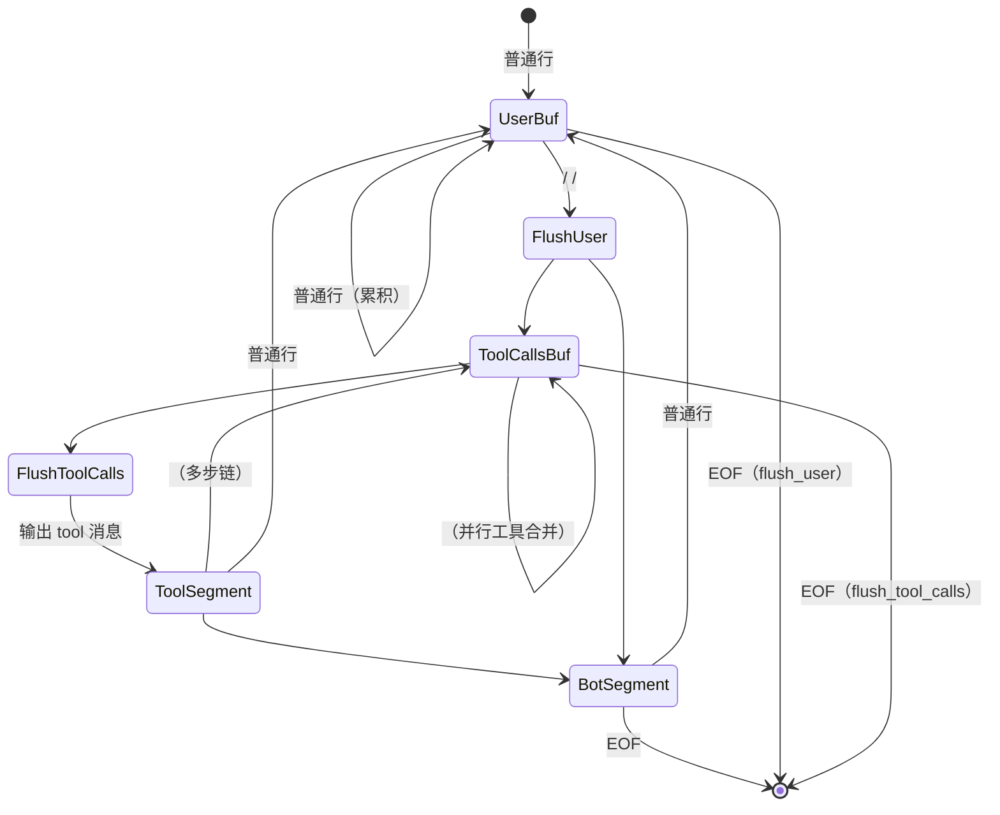
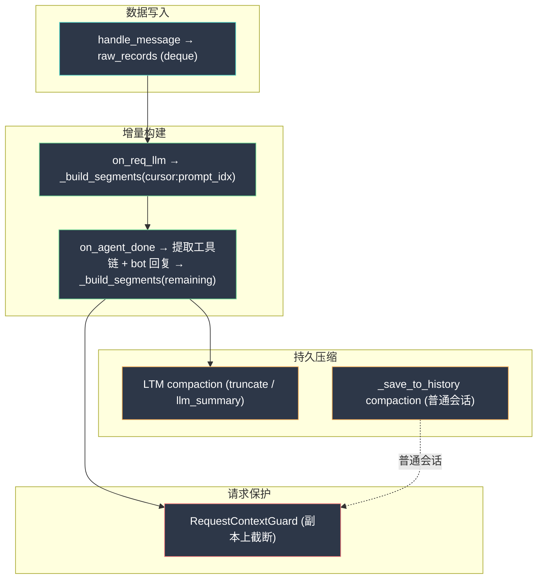

# PR #8144 深度代码分析

> `refactor(ltm): redesign long-term memory with append-only incremental contexts`

---

## 一、架构对比：旧 vs 新

### 旧架构（Ring Buffer）



**致命问题**：
1. **每次 pop(0) 后整个列表重新拼接** → 前缀全变 → KV Cache 100% miss
2. bot 回复用 `[You/time]` 格式 → 和用户消息混在一起 → 无法被 LLM 区分 role
3. 工具调用链完全不记录
4. 无并发保护

### 新架构（Append-Only）



---

## 二、数据流精析

### 2.1 核心数据结构

| 字段 | 类型 | 作用 | 生命周期 |
|---|---|---|---|
| `raw_records[umo]` | `deque[str]` | 原始文本记录（群消息 + 工具链 + bot 回复） | 消费后被 `_trim_raw_records` 清除 |
| `_raw_cursor[umo]` | `int` | 指向 `raw_records` 中下一条未消费的索引 | 随构建推进 |
| `contexts[umo]` | `list[dict]` | OpenAI 格式的累积上下文（**核心 append-only 结构**） | 只追加，仅在 compaction 时截断 |
| `_persisted_tool_call_ids[umo]` | `set[str]` | 已持久化的 tool_call_id | 防止跨轮重复注入 |
| `summaries[umo]` | `str` | LLM 摘要文本（llm_summary 策略） | 摘要成功后替换 |

### 2.2 一轮完整交互的数据流

```
时间线 →

T1: 群消息到达（handle_message）
    raw_records = ["[小明/14:30]: @bot 查天气"]
    _raw_cursor = 0
    event._ltm_raw_idx = 0

T2: LLM 请求（on_req_llm）
    new_raw = raw_records[0:0] = []  ← cursor == prompt_idx，无新消息
    contexts 不变
    但仍然注入已有 contexts + CHATROOM_SYSTEM_NOTE

T3: Agent 执行工具 + 返回结果（on_agent_done）
    raw_records 追加:
      "<T:CALL>{"id":"c1","name":"weather","args":{"city":"bj"}}</T:CALL>"
      "<T:RES id=c1>晴天 25°C</T:RES>"
      "<BOT/14:30>: 北京今天晴天，25°C"
    
    remaining = raw_records[0:]  ← cursor=0 到末尾
    _build_segments(remaining) → [
      {role: "user",      content: "[小明/14:30]: @bot 查天气"},
      {role: "assistant", content: null, tool_calls: [{id:"c1",...}]},
      {role: "tool",      tool_call_id: "c1", content: "晴天 25°C"},
      {role: "assistant", content: "北京今天晴天，25°C"},
    ]
    contexts[umo].extend(↑)
    cursor = len(raw_records)
    
    _trim_raw_records() → 清除 cursor 之前的已消费条目

T4: 下一条群消息（handle_message）
    raw_records.append("[小红/14:31]: 好天气~")
    ← contexts 不变，前缀稳定 → KV Cache 命中
```

> [!IMPORTANT]
> **关键设计**：`on_req_llm` 只消费到 `prompt_idx`（当前用户消息之前的群消息），而 `on_agent_done` 消费剩余全部（包括当前用户的 @bot 消息 + 工具链 + bot 回复）。这确保了：
> 1. LLM 看到的是"其他人说了什么" + "自己之前的历史"
> 2. 当前轮的 @bot prompt 不会被重复注入

---

## 三、`_build_segments` 状态机



**规则总结**：
- 连续 `<T:CALL>` → 合并为 **一个** `assistant(tool_calls=[...])`（并行工具）
- `<T:RES>` 出现时先 flush tool_calls → 输出 tool 消息
- `<BOT/>` → 独立 `assistant(content=...)` 段
- 普通行累积后 flush → `user(content="\n".join(...))`，段内裁剪 50 条 / 3000 字符

---

## 四、双层压缩架构

### 4.1 持久层压缩（LTM，群聊专用）

在 `on_agent_done` 末尾执行，两种互斥策略：

| 策略 | 触发条件 | 行为 |
|---|---|---|
| `truncate`（默认） | `rounds > ltm_max_rounds`（默认 80） | 从前面丢弃 `ltm_truncate_drop_rounds`（默认 50）轮 |
| `llm_summary` | `rounds > ltm_summary_trigger_rounds`（默认 80） | 调用 LLM 将旧轮摘要为 summary，保留最近 30 轮精确上下文 |

**LLM Summary 的容错机制**：
```python
# 摘要失败 → 设置冷却期（当前 rounds + 5）
self._summary_next_retry[umo] = len(rounds) + SUMMARY_RETRY_COOLDOWN
# 冷却期内跳过 → 避免反复调用失败的 LLM
if len(rounds) < next_retry:
    logger.debug("冷却中...")
```

### 4.2 请求层保护（RequestContextGuard，所有会话）

```python
# tool_loop_agent_runner.py L717-725
# 在每次 LLM 请求前，复制一份 messages 进行截断
self._provider_messages = await self.request_context_guard.process(
    self.run_context.messages,  # 不修改原始
    trusted_token_usage=token_usage
)
# 发送给 provider 时用 _provider_messages
messages_for_provider = getattr(self, "_provider_messages", self.run_context.messages)
```

> [!TIP]
> **关键分离**：`RequestContextGuard` 操作的是**副本**，`run_context.messages` 保持完整。这确保了：
> 1. 工具链不会被截断（工具调用必须配对）
> 2. 持久化时保存完整历史
> 3. 下一轮请求时前缀不变

### 4.3 持久会话压缩（internal.py `_save_to_history`，普通会话）

这是 PR 新增的第三层压缩，针对**普通会话**（非群聊 LTM）：

```python
if _history_exceeds_turn_limit(messages_to_save, self.max_context_length):
    if compress_provider is not None:
        # LLM 摘要压缩
        compressed = await compressor(original_messages)
        if not _has_valid_summary_message(compressed):
            messages_to_save = fallback_truncate()  # 回退
        else:
            messages_to_save = compressed
    else:
        messages_to_save = fallback_truncate()  # 按轮截断
```

---

## 五、并发安全分析

```python
self._locks: dict[str, asyncio.Lock] = {}

def _get_lock(self, umo: str) -> asyncio.Lock:
    lock = self._locks.get(umo)
    if lock is None:
        lock = asyncio.Lock()
        self._locks[umo] = lock
    return lock
```

> [!WARNING]
> **`_get_lock` 本身不是线程安全的**。如果两个协程同时首次访问同一个 `umo`，理论上可能创建两个 Lock。但在 asyncio 单线程事件循环中，这不是问题——`dict.get` 和赋值不会被中断。如果未来引入多线程，需要加保护。

**锁粒度**：per-umo（每群一把锁），不同群完全并行。PR 中有测试验证了这一点（`test_slow_summary_does_not_block_other_umo`）。

---

## 六、潜在问题与改进点

### 6.1 🔴 `_trim_raw_records` 的 size-based 分支已修复

Sourcery-AI 指出的 bug（cursor 在第一个循环后归零导致 size-based 分支永远不执行）在**后续 commit 中已修复**：

```python
# 修复后的代码（当前版本）
while total > max_bytes and dq:           # 移除了 cursor > 0 条件
    removed = dq.popleft()
    total -= len(removed.encode())
    if cursor > 0:
        cursor -= 1
```

### 6.2 🟡 `raw_records` 的 O(n) 序列化开销

```python
raw_list = list(self.raw_records[umo])  # deque → list 复制
```

`on_req_llm` 和 `on_agent_done` 中各有一次 `list()` 转换。对于活跃群（数千条 raw_records），这是 O(n) 开销。但由于 `_trim_raw_records` 会清理已消费条目，实际 deque 长度通常不大。

### 6.3 🟡 `cfg()` 每次调用都重新解析

```python
def cfg(self, event: AstrMessageEvent):
    cfg = self.context.get_config(umo=event.unified_msg_origin)
    # ...大量解析逻辑...
```

`on_agent_done` 中调用了 `self.cfg(event)`，而 `cfg()` 内部没有缓存。如果 `get_config` 本身有缓存则影响不大，否则高频群会有性能问题。

### 6.4 🟡 `_persisted_tool_call_ids` 无限增长

```python
self._persisted_tool_call_ids: dict[str, set[str]] = defaultdict(set)
```

这些 set 只增不减（除非 `remove_session`）。如果一个群长期运行且频繁使用工具，set 会持续增长。建议在 compaction 时同步清理过期的 ID。

### 6.5 🟢 `on_req_llm` 中 `prompt_idx` 的精确排除

```python
raw_idx = len(self.raw_records[umo])     # handle_message 时记录
event.set_extra("_ltm_raw_idx", raw_idx)  # 存入 event

# on_req_llm 时
prompt_idx = event.get_extra("_ltm_raw_idx", -1)
new_raw = raw_list[cursor:prompt_idx]     # 不包含当前 @bot 消息本身
```

这个设计很精巧——确保 `on_req_llm` 构建的 contexts 不包含当前用户的 @bot 消息（那条消息会作为 `req.prompt` 单独发送），避免了重复。

### 6.6 🟡 Hook 从 `@on_llm_response` 改为 `@on_agent_done`

旧 hook `on_llm_response` 只能捕获最终文本回复，无法获取工具调用链。新 hook `on_agent_done` 接收 `run_context`（包含完整 messages 列表），可以遍历提取所有工具调用。

**影响**：其他依赖 `on_llm_response` 的插件不受影响，因为 `on_llm_response` 仍然存在，只是 LTM 不再使用它。

---

## 七、对插件开发的影响

### 7.1 `ProviderRequest.contexts` 类型变化

旧代码：`contexts` 是 `list[str]` 或空列表
新代码：`contexts` 是 `list[dict]`（OpenAI message 格式）

如果你的插件在 `on_llm_request` 中操作 `req.contexts`，需要确保兼容 dict 格式。

### 7.2 `req.conversation = None` 的影响

群聊 LTM 模式下，`on_req_llm` 会设置 `req.conversation = None`，这意味着：
- Agent runner 不会查询 Conversation DB
- 不会保存到会话历史
- 上下文完全由 LTM 管理

### 7.3 新配置项

```python
"provider_ltm_settings": {
    # 删除: "group_message_max_cnt": 300
    # 新增:
    "history_tool_result_truncate": True,
    "history_tool_result_max_chars": 8192,
    "ltm_compaction_strategy": "truncate",  # or "llm_summary"
    "ltm_max_rounds": 80,
    "ltm_truncate_drop_rounds": 50,
    "ltm_summary_trigger_rounds": 80,
    "ltm_summary_keep_recent_rounds": 30,
    "ltm_summary_provider_id": "",
    "ltm_summary_prompt": "",
    "ltm_raw_records_max_bytes": 500000,
}
```

### 7.4 `context_limit_reached_strategy` 默认值变更

```diff
- "context_limit_reached_strategy": "truncate_by_turns"
+ "context_limit_reached_strategy": "llm_compress"
```

这是一个**行为变更**——升级后，所有用户默认从"按轮截断"切换到"LLM 压缩"。如果用户没有配置压缩模型，新代码会**自动回退到主聊天模型**进行压缩。

---

## 八、总结



**核心价值**：通过 append-only 保证前缀稳定 → KV Cache 命中 → 省钱。围绕这个目标，重构了整个上下文管理体系：写入/构建分离、请求级保护不修改持久历史、双层压缩策略互斥。
