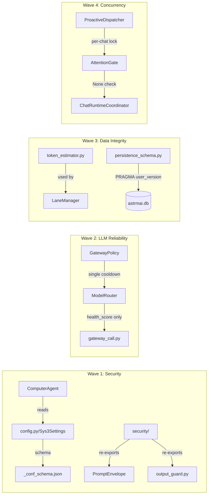

# Design Document

> 本文档对应 Spec `astrmai-critical-hardening`，描述 7 个生产阻断级硬伤的修复设计方案。
> 不包含状态机竞态、决策点优化、资源泄漏、WebUI 加固、代码质量治理。
> 凡涉及 `ModelRouter` 冷却机制和 `GatewayPolicy` fatal 判定的改动，本阶段一律先方案后落地。

## 1. Overview

### 1.1 整体策略

按「安全隔离 → LLM 可靠性 → 数据完整性 → 并发正确性」四波推进。

| Wave | 主要动作 | 改动文件 | 改动类型 |
|------|---------|---------|---------|
| ① Wave 1 | ComputerAgent 增加配置开关 + Security 模块建立集中入口 | `computer_agent.py`, `config.py`, `_conf_schema.json`, `security/` (new×3) | 安全增强 |
| ② Wave 2 | 修复 timeout fatal 误判 + 统一双冷却入口 | `gateway_policy.py`, `model_router.py`, `gateway_call.py` | Bug 修复 |
| ③ Wave 3 | 集成 Token 估算器 + 引入 DB Schema 版本追踪 | `token_estimator.py` (new), `lane_manager.py`, `persistence_schema.py` | 数据完整性 |
| ④ Wave 4 | ProactiveDispatcher 增加 per-chat 注入锁 | `dispatcher.py`, `gate.py`, `chat_runtime_coordinator.py` | 并发修复 |

### 1.2 设计边界（重申）

- 不创建新的 SubAgent 类型
- 不修改 `_conf_schema.json` 中已有配置项的语义（仅新增 `computer_agent_sandbox_enabled`）
- 不修改 `PromptEnvelope.sanitize_*` 方法的内部实现（仅 re-export）
- 不引入 Alembic 等重型迁移框架
- 不新增 pip 依赖（除 R5 Token 估算器的可选 `tiktoken`）
- 不删除任何现有文件

### 1.3 与 AstrBot 框架的接口预留

| 预留点 | 位置 | 用途 |
|--------|------|------|
| `ExecuteShellTool(sandbox_mode=...)` | `computer_agent.py:L50` | R1 若框架支持沙盒模式，注入参数 |
| `PRAGMA user_version` | `persistence_schema.py` | R6 轻量 Schema 版本追踪 |
| `astrbot.core.computer.tools.*` | `computer_agent.py:L7-8` | R1 条件导入，依赖框架版本 |

---

## 2. Architecture

### 2.1 系统总体形态（修复前后对比）

```
修复前：                         修复后：
┌──────────────┐                ┌──────────────────────┐
│ ComputerAgent│                │ ComputerAgent         │
│ always armed │                │ sandbox_enabled? ─┐  │
│ LocalPython  │                │  YES → tools loaded│  │
│ ExecuteShell │                │  NO  → DECLINE     │  │
└──────────────┘                └──────────────────────┘

┌──────────────┐                ┌──────────────────────┐
│ ModelRouter  │                │ ModelRouter           │
│ _cooldown    │                │ health_score only     │
│ _until ✗     │                │ cooldown via callback │
│              │                │         ↓             │
│ GatewayPolicy│                │ GatewayPolicy         │
│ _model_      │                │ _model_cooldowns      │
│ cooldowns ✓  │                │ (single source)       │
└──────────────┘                └──────────────────────┘

┌──────────────┐                ┌──────────────────────┐
│ Security/    │                │ Security/             │
│ __init__.py  │                │ __init__.py (re-export│
│ (1 line)     │                │ input_sanitizer.py    │
│              │                │ output_guard.py       │
│              │                │ rate_limiter.py       │
└──────────────┘                └──────────────────────┘

┌──────────────┐                ┌──────────────────────┐
│ Dispatcher   │                │ Dispatcher            │
│ detach       │                │ per-chat Lock         │
│ restore      │                │ ├─ detach             │
│ (no lock)    │                │ ├─ inject             │
│              │                │ └─ restore            │
└──────────────┘                └──────────────────────┘
```

### 2.2 模块依赖图（修复后目标）



### 2.3 关键不变量（本 Spec 阶段冻结）

| 不变量 | 来源 | 冻结理由 |
|--------|------|---------|
| `ComputerAgent.name = "transfer_to_computer"` 不可变 | `computer_agent.py:L20` | Sys3 Router 通过此名称匹配 SubAgent |
| `GatewayPolicy._model_cooldowns` 作为冷却唯一入口 | `gateway_policy.py:L53` | R4 统一冷却后，所有冷却查询必须经由此 dict |
| `_conf_schema.json` 已有配置项的 `default` 值不可变 | `_conf_schema.json` 全文 | 向后兼容，只新增不修改 |
| `PromptEnvelope.sanitize_user_input()` 签名不可变 | `prompt_envelope.py:L12` | R2 仅 re-export，不修改内部实现 |
| `LaneManager.DEFAULT_POLICIES` 中的 `max_raw_turns` 值不可变 | `lane_manager.py:L37-54` | R5 新增 token 估算但不改变现有消息条数阈值 |
| `AttentionGate.inject_external_event()` 签名不可变 | `gate.py` | R7 仅加锁，不改变接口契约 |

---

## 3. Wave 1 — 安全隔离（R1–R2）

### 3.1 R1: ComputerAgent 零沙箱隔离

**涉及文件**: `astrmai/workmode/subagents/computer_agent.py`, `config.py`, `_conf_schema.json`, `astrmai/workmode/router.py`

#### 3.1.1 当前状态

`computer_agent.py`（全文 57 行）中，工具加载完全依赖 AstrBot 框架的 import 是否成功：

```python
# L6-13: 仅检查 import，不检查配置
try:
    from astrbot.core.computer.tools.python import LocalPythonTool
    from astrbot.core.computer.tools.shell import ExecuteShellTool
    _COMPUTER_TOOLS_AVAILABLE = True
except ImportError:
    _COMPUTER_TOOLS_AVAILABLE = False

# L45-51: 无条件返回工具
async def get_tool_set(self, ctx, event) -> ToolSet:
    if not _COMPUTER_TOOLS_AVAILABLE:
        return ToolSet([])
    return ToolSet([
        LocalPythonTool(),           # L49: 无沙盒
        ExecuteShellTool(is_local=True),  # L50: is_local=True 在宿主机直执
    ])
```

`Sys3Router.__init__()`（`router.py:L14-23`）无条件创建 `ComputerAgent()`，不传 config。

`Sys3Settings`（`config.py:L200-201`）只有 `enable_work_mode` 一个字段。

`_conf_schema.json`（L730-741）`sys3` 分组只有 `enable_work_mode` 一项。

#### 3.1.2 设计决策

**方案：配置开关 + 管理员权限双层门控。**

1. `config.py` — `Sys3Settings` 新增字段：
   ```python
   class Sys3Settings(BaseModel):
       enable_work_mode: bool = Field(default=False)
       computer_agent_sandbox_enabled: bool = Field(default=False, description="是否启用 ComputerAgent 的代码执行能力（需管理员权限）")
   ```

2. `_conf_schema.json` — `sys3.items` 新增：
   ```json
   "computer_agent_sandbox_enabled": {
       "description": "启用 ComputerAgent 代码执行（需管理员权限）",
       "type": "bool",
       "default": false,
       "hint": "开启后 ComputerAgent 才能加载 Python/Shell 工具。注意：此功能在宿主机直执，请仅在受信任环境开启。"
   }
   ```

3. `computer_agent.py` — 模块级变量 `_COMPUTER_TOOLS_AVAILABLE` 从 `True` 改为 `False`，由 `ComputerAgent.__init__` 根据 config 决定是否加载：
   ```python
   _COMPUTER_TOOLS_AVAILABLE = False  # 默认不加载
   
   @dataclass
   class ComputerAgent(AstrMaiBaseSubAgent):
       sandbox_enabled: bool = False  # 新增字段，由 Router 注入
   
       async def get_tool_set(self, ctx, event) -> ToolSet:
           if not self.sandbox_enabled:
               return ToolSet([])
           # ... 原有 import 检查 + 工具加载
   ```

4. `router.py` — `Sys3Router.__init__` 从 config 读取 `sandbox_enabled` 并注入：
   ```python
   sandbox_enabled = bool(getattr(getattr(plugin_config, 'sys3', None), 'computer_agent_sandbox_enabled', False))
   self._static_agents = [
       CronAgent(db_service=db_service),
       ComputerAgent(sandbox_enabled=sandbox_enabled),  # 注入配置
   ]
   ```

5. `base_agent.py:L72-80` — DECLINE 逻辑已存在，无需修改。当 `ToolSet([])` 时优雅降级为 `[SUBAGENT_DECLINE]`。

#### 3.1.3 影响范围

| 文件 | 改动 | 行数估计 |
|------|------|:------:|
| `config.py` | `Sys3Settings` 新增 `computer_agent_sandbox_enabled` 字段 | +3 |
| `_conf_schema.json` | `sys3.items` 新增配置项 | +7 |
| `computer_agent.py` | `_COMPUTER_TOOLS_AVAILABLE = False` + `sandbox_enabled` 字段 + `get_tool_set` 增加配置判断 | +6/-2 |
| `router.py` | `__init__` 读取 config 并注入 `sandbox_enabled` | +3/-1 |

#### 3.1.4 禁止改动

- **不**修改 `base_agent.py` 的 `call()` 方法（DECLINE 逻辑已正确）
- **不**修改 `ComputerAgent.name = "transfer_to_computer"`（Router 匹配依赖此名称）
- **不**修改 `ComputerAgent.get_system_prompt()` 的安全提示文本（defense-in-depth）
- **不**修改 `ExecuteShellTool` 和 `LocalPythonTool` 的 AstrBot 框架源码

---

### 3.2 R2: Security 模块空壳

**涉及文件**: `astrmai/infrastructure/security/` (new×3), `astrmai/conversation/contracts/prompt_envelope.py` (只读引用), `astrmai/infrastructure/gateway/output_guard.py` (只读引用)

#### 3.2.1 当前状态

`astrmai/infrastructure/security/__init__.py`（全文 1 行）：
```python
"""Security helpers package."""
```

安全逻辑分散在 3 处：
- `prompt_envelope.py:L12-20` `sanitize_user_input()` — `<user_input>` 标签包裹
- `prompt_envelope.py:L23-32` `sanitize_memory_content()` — `<retrieved_memory>` 标签包裹
- `gateway/output_guard.py` — 输出安全检查（provider failure text / scaffold / tool protocol 检测）

#### 3.2.2 设计决策

**方案：新增 3 个子模块 + `__init__.py` re-export。第一期不删除原有分散逻辑。**

```text
astrmai/infrastructure/security/
├── __init__.py             # re-export InputSanitizer, OutputGuard, RateLimiter
├── input_sanitizer.py      # 封装 PromptEnvelope 的 sanitize 方法
├── output_guard.py         # re-export gateway/output_guard.py 的主要类
└── rate_limiter.py         # TokenBucket 基础实现
```

1. `input_sanitizer.py`:
   ```python
   class InputSanitizer:
       @staticmethod
       def sanitize(text: str) -> str:
           # 当前封装 PromptEnvelope.sanitize_user_input
           # 预留：future 增加 DB 写入前净化、API body 净化
           from ....conversation.contracts.prompt_envelope import PromptEnvelope
           return PromptEnvelope.sanitize_user_input(text)
       
       @staticmethod
       def sanitize_memory(text: str) -> str:
           from ....conversation.contracts.prompt_envelope import PromptEnvelope
           return PromptEnvelope.sanitize_memory_content(text)
   ```

2. `output_guard.py`:
   ```python
   # 从 gateway/output_guard.py re-export 主要出口
   from ..gateway.output_guard import (
       validate_visible_output_text,
       extract_provider_failure_text_hints,
       extract_prompt_scaffold_hints,
   )
   ```

3. `rate_limiter.py`:
   ```python
   import time, asyncio
   
   class TokenBucket:
       """轻量 TokenBucket 限流器，供 WebUI API 和 LLM 调用复用。"""
       def __init__(self, rate: float, capacity: int):
           self.rate = rate
           self.capacity = capacity
           self.tokens = float(capacity)
           self.last_refill = time.monotonic()
           self._lock = asyncio.Lock()
       
       async def consume(self, tokens: int = 1) -> bool:
           ...
   ```

4. `__init__.py`:
   ```python
   from .input_sanitizer import InputSanitizer
   from .output_guard import validate_visible_output_text
   from .rate_limiter import TokenBucket
   ```

#### 3.2.3 影响范围

| 文件 | 改动 | 行数估计 |
|------|------|:------:|
| `security/__init__.py` | 替换 docstring 为 re-export | +5/-1 |
| `security/input_sanitizer.py` | **新建** | +20 |
| `security/output_guard.py` | **新建** | +10 |
| `security/rate_limiter.py` | **新建** | +35 |
| `prompt_envelope.py` | `sanitize_*` 方法增加 `# TODO: migrate to security.InputSanitizer` 注释 | +2 |
| `gateway/output_guard.py` | 主要函数增加 `# re-exported via security.output_guard` 注释 | +2 |

#### 3.2.4 禁止改动

- **不**修改 `PromptEnvelope.sanitize_*` 的内部实现
- **不**删除 `gateway/output_guard.py` 中的任何函数
- **不**引入第三方限流库（`aiolimiter` 等）
- **不**在本期修改任何调用点改用新 security 模块（仅建立入口）

---

## 4. Wave 2 — LLM 调用可靠性（R3–R4）

### 4.1 R3: `_is_fatal_failure` 将网络超时误判为致命错误

**涉及文件**: `astrmai/infrastructure/gateway/gateway_policy.py`

#### 4.1.1 当前状态

`gateway_policy.py:L143-161`:
```python
def _is_fatal_failure(self, error_message: str) -> bool:
    lowered = str(error_message).lower()
    fatal_keywords = (
        "429", "ratelimit", "rate limit", "too many requests",
        "403", "permissiondenied", "permission denied",
        "usage limit", "quota", "billing cycle",
        "invalid_request_error",
        "apitimeouterror",
        "request timed out",
        "timeout",                         # ← L159: 裸关键字！
    )
    return any(keyword in lowered for keyword in fatal_keywords) or "content=none" in lowered
```

`_classify_failure_kind()` (L123-141) 中 `"timeout"` (L137) 也使用裸关键字匹配。

问题：`asyncio.TimeoutError` 的默认消息可能包含 `"timeout"` → 被误判为 fatal → 模型被立即放弃（`gateway_call.py` 中 `_elastic_call_result` 的 fatal 分支 `break` 跳出重试循环）。

#### 4.1.2 设计决策

**方案：区分 `asyncio.TimeoutError`（客户端超时，非 fatal）和 provider 返回的超时错误（服务端超时，可选 fatal）。**

1. `_classify_failure_kind()` 修改：
   ```python
   def _classify_failure_kind(self, error_message: str, error: Exception | None = None) -> FailureKind:
       # 新增 error 参数
       if error is not None and isinstance(error, asyncio.TimeoutError):
           return FailureKind.TIMEOUT
       lowered = str(error_message).lower()
       # ... 原有逻辑保留
   ```

2. `_is_fatal_failure()` 修改：
   ```python
   def _is_fatal_failure(self, error_message: str, error: Exception | None = None) -> bool:
       # 新增 error 参数
       if error is not None and isinstance(error, asyncio.TimeoutError):
           return False  # 客户端超时不致命，应重试
       lowered = str(error_message).lower()
       fatal_keywords = (
           "429", "ratelimit", "rate limit", "too many requests",
           "403", "permissiondenied", "permission denied",
           "usage limit", "quota", "billing cycle",
           "invalid_request_error",
           "apitimeouterror",
           "request timed out",   # 精确匹配
           "timed out",           # 精确匹配 "timed out"
           "408",                 # 新增 HTTP 408
           "504",                 # 新增 HTTP 504
           # "timeout",            # ← 移除裸关键字！
       )
       return any(keyword in lowered for keyword in fatal_keywords) or "content=none" in lowered
   ```

3. 调用方 `gateway_call.py` 传递原始 `Exception` 对象：
   ```python
   # 修改前：
   is_fatal = self._is_fatal_failure(str(exc))
   # 修改后：
   is_fatal = self._is_fatal_failure(str(exc), error=exc)
   ```

#### 4.1.3 影响范围

| 文件 | 改动 | 行数估计 |
|------|------|:------:|
| `gateway_policy.py` | `_classify_failure_kind` 新增 `error` 参数 + `isinstance` 检查；`_is_fatal_failure` 新增 `error` 参数 + 移除裸 `"timeout"` + 新增 `"408"`/`"504"` | +8/-3 |
| `gateway_call.py` | `_elastic_call_result` 中调用 `_is_fatal_failure` 时传递 `error=exc` | +2/-2 |

#### 4.1.4 禁止改动

- **不**修改其他 fatal_keywords 条目（429/403/quota 等判定不变）
- **不**修改 `_open_model_cooldown` 的冷却时长
- **不**修改 `_classify_cooldown_reason` 的分类逻辑

---

### 4.2 R4: Gateway 双冷却系统冲突

**涉及文件**: `astrmai/infrastructure/gateway/gateway_policy.py`, `astrmai/infrastructure/gateway/model_router.py`

#### 4.2.1 当前状态

**ModelRouter** (`model_router.py:L27, L111`):
```python
@dataclass
class ModelState:
    cooldown_until: float = 0.0  # L27: 独立冷却

# L111: get_ranked_models() 中使用自己的冷却
if state.cooldown_until > now:
    cooling.append((mid, state))
```

**GatewayPolicy** (`gateway_policy.py:L53`):
```python
# L53: 独立冷却 dict
getattr(self, "_model_cooldowns", {})[self._cooldown_key(pool_name, model_id)] = meta
```

两个冷却系统：
- `ModelRouter._cooldown_until`：自适应 30–120s（`report_failure` 时设置）
- `GatewayPolicy._model_cooldowns`：按原因分类 120s（rate_limit）或 1800s（quota）

在 `_elastic_call_result()` 中，一个模型失败后：
1. `router.report_failure()` → 设置 `_cooldown_until`（30-120s）
2. `_open_model_cooldown()` → 设置 `_model_cooldowns`（120s 或 1800s）
3. `_filter_cooldown_attempt_queue()` → 检查 `_model_cooldowns`
4. `get_ranked_models()` → 同时检查 `_cooldown_until`

→ 同一模型被双重冷却。

#### 4.2.2 设计决策

**方案：`GatewayPolicy._model_cooldowns` 作为冷却唯一入口，`ModelRouter` 废弃 `_cooldown_until` 仅维护健康评分。**

1. `ModelRouter` 修改：
   - 删除 `ModelState.cooldown_until` 字段
   - `get_ranked_models()` 新增 `cooldown_checker` 参数：
     ```python
     def get_ranked_models(
         self, pool_name, models, sticky_key="", sticky_preferred="",
         cooldown_checker: Callable[[str, str], bool] | None = None,
     ) -> List[str]:
         # ...
         for mid in unique_models:
             if cooldown_checker and cooldown_checker(pool_name, mid):
                 cooling.append((mid, state))
             else:
                 available.append((mid, state))
     ```
   - 保留 `report_success` / `report_failure` 的健康评分逻辑，但不再设置冷却时间

2. `GatewayPolicy` 新增 `_is_model_cooldown()` 方法：
   ```python
   def _is_model_cooldown(self, pool_name: str, model_id: str) -> bool:
       meta = self._model_cooldown_meta(pool_name, model_id)
       return bool(meta)
   ```

3. `_build_attempt_queue()` 传递 `cooldown_checker`：
   ```python
   primary_models = self.router.get_ranked_models(
       pool_name, models,
       sticky_key=sticky_key, sticky_preferred=sticky_preferred,
       cooldown_checker=self._is_model_cooldown,
   )
   ```

4. 冷却时长统一由 `GatewayPolicy._open_model_cooldown()` 管理：
   - `BASE_COOLDOWN_SEC=30` / `MAX_COOLDOWN_SEC=120`（原 ModelRouter 常量）合并到 `GatewayPolicy`
   - `report_failure` 时的自适应冷却改为调用 `_open_model_cooldown(reason="consecutive_failures")`

#### 4.2.3 影响范围

| 文件 | 改动 | 行数估计 |
|------|------|:------:|
| `model_router.py` | 删除 `ModelState.cooldown_until`；`get_ranked_models` 新增 `cooldown_checker` 参数；`report_failure` 不再设置冷却；删除 `BASE_COOLDOWN_SEC`/`MAX_COOLDOWN_SEC` 常量（移入 `gateway_policy.py`） | +15/-20 |
| `gateway_policy.py` | 新增 `_is_model_cooldown()`；合并 ModelRouter 冷却常量；`_build_attempt_queue` 传递 `cooldown_checker` | +25/-3 |

#### 4.2.4 禁止改动

- **不**修改 `GatewayPolicy._classify_cooldown_reason()` 的分类逻辑
- **不**修改冷却时长（120s/1800s）
- **不**修改 `ModelRouter` 的健康评分算法（`SUCCESS_REWARD=1`, `FAILURE_PENALTY=-2`, `FATAL_PENALTY=-4`）
- **不**修改 `_filter_cooldown_attempt_queue()` 的兜底逻辑（全部冷却时取最早解冻的模型）

---

## 5. Wave 3 — 数据完整性（R5–R6）

### 5.1 R5: 上下文压缩无 Token 计数

**涉及文件**: `astrmai/infrastructure/context_economy/token_estimator.py` (new), `astrmai/infrastructure/runtime/lane_manager.py`, `astrmai/shared/constants/defaults.py`

#### 5.1.1 当前状态

`LaneManager.DEFAULT_POLICIES`（`lane_manager.py:L37-54`）全部基于 `max_raw_turns`（消息条数）控制压缩：

```python
("sys2", "dialog"): LanePolicy(store_mode="full", max_raw_turns=12),
```

`LanePolicy`（L27-31）有 `summarize_threshold_tokens: int = 0` 字段，但**从未被赋值或使用**。

`ContextEconomyCenter` 的 `build_request()` 和 `resolve_policy()` 不涉及 token 计数。

配置项 `_conf_schema.json:L168-201` 中 `warm_zone_max_tokens=1200` / `compaction_trigger_tokens=1800` 语义是 token 但实际按消息条数执行。

#### 5.1.2 设计决策

**方案：新增 `token_estimator.py` 提供字符/4 粗略估算 + `LanePolicy.summarize_threshold_tokens` 被实际使用。**

1. `token_estimator.py`（新建）:
   ```python
   def estimate_tokens(text: str) -> int:
       """轻量 Token 估算：字符数/4 粗略估算。对中文约 1.5-2 token/字，英文约 0.25 token/字。"""
       if not text:
           return 0
       # 粗略估算：(中文字符 * 1.5 + 非中文字符 * 0.25) / 平均
       import re
       chinese_chars = len(re.findall(r'[\u4e00-\u9fff]', text))
       other_chars = len(text) - chinese_chars
       return max(1, int(chinese_chars * 1.5 + other_chars * 0.3))
   ```

2. `defaults.py` — `InfrastructureSettings` 新增字段：
   ```python
   @dataclass(frozen=True, slots=True)
   class InfrastructureSettings:
       # ... 原有字段
       token_estimator_enabled: bool = False
   ```

3. `build_infrastructure_settings()` 读取配置：
   ```python
   token_estimator_enabled=bool(getattr(getattr(config, "conversation", None), "enable_token_estimator", False))
   ```

4. `lane_manager.py` — `LanePolicy` 字段实际使用：
   ```python
   @dataclass(frozen=True)
   class LanePolicy:
       store_mode: str
       max_raw_turns: int
       summarize_threshold_tokens: int = 0  # 已有字段，赋值即可
       
   # 更新 DEFAULT_POLICIES：
   ("sys2", "dialog"): LanePolicy(store_mode="full", max_raw_turns=12, summarize_threshold_tokens=1800),
   ```

5. `_compact_history()` 在 token_estimator 启用时优先使用 token 阈值：
   ```python
   if token_estimator_enabled and policy.summarize_threshold_tokens > 0:
       estimated = sum(estimate_tokens(msg) for msg in history)
       if estimated >= policy.summarize_threshold_tokens:
           # 触发压缩
   ```

#### 5.1.3 影响范围

| 文件 | 改动 | 行数估计 |
|------|------|:------:|
| `context_economy/token_estimator.py` | **新建** | +25 |
| `shared/constants/defaults.py` | `InfrastructureSettings` 新增 `token_estimator_enabled` | +2 |
| `runtime/lane_manager.py` | `DEFAULT_POLICIES` 中 sys2/dialog 增加 `summarize_threshold_tokens=1800`；`LaneHistoryMixin._compact_history` 增加 token 估算分支 | +15 |
| `_conf_schema.json` | `conversation` 分组新增 `enable_token_estimator` | +6 |

#### 5.1.4 禁止改动

- **不**修改 `DEFAULT_POLICIES` 中已有的 `max_raw_turns` 值（向后兼容）
- **不**修改 `LanePolicy` 的现有字段签名（仅赋值已有的 `summarize_threshold_tokens`）
- **不**引入 `tiktoken` 作为必须依赖（第一期用字符/4 估算）
- **不**修改 `_conf_schema.json` 中已有的 `warm_zone_max_tokens` / `compaction_trigger_tokens` 配置项名称

---

### 5.2 R6: 数据库迁移零版本管理

**涉及文件**: `astrmai/infrastructure/persistence/persistence_schema.py`

#### 5.2.1 当前状态

`persistence_schema.py:L79-134`:
```python
def _init_db_sync(self):
    with sqlite3.connect(self.db_path) as db:
        db.execute("""CREATE TABLE IF NOT EXISTS chat_states (...)""")
        db.execute("""CREATE TABLE IF NOT EXISTS user_profiles (...)""")
        self._apply_schema_patch_batch_sync(db, [
            "ALTER TABLE chat_states ADD COLUMN last_reply_time REAL DEFAULT 0",
            "ALTER TABLE chat_states ADD COLUMN last_passive_decay_time REAL DEFAULT 0",
            # ... 数十条 ALTER TABLE
        ])
```

`_apply_schema_patch_batch_sync()` 通过 `try: db.execute(ddl) except: pass` 执行所有 DDL，靠 sqlite3 抛出 "duplicate column name" 来跳过已存在的列。

#### 5.2.2 设计决策

**方案：`PRAGMA user_version` 轻量版本追踪。**

1. 定义版本化迁移列表：
   ```python
   MIGRATIONS: list[tuple[int, str]] = [
       (1, "ALTER TABLE chat_states ADD COLUMN last_reply_time REAL DEFAULT 0"),
       (2, "ALTER TABLE chat_states ADD COLUMN last_passive_decay_time REAL DEFAULT 0"),
       (3, "ALTER TABLE chat_states ADD COLUMN last_energy_recovery_time REAL DEFAULT 0"),
       # ... 按版本号排序
   ]
   ```

2. `_init_db_sync()` 修改：
   ```python
   def _init_db_sync(self):
       with sqlite3.connect(self.db_path) as db:
           # 建表（保留原有逻辑）
           db.execute("""CREATE TABLE IF NOT EXISTS chat_states (...)""")
           db.execute("""CREATE TABLE IF NOT EXISTS user_profiles (...)""")
           
           # 读取当前版本
           current_version = db.execute("PRAGMA user_version").fetchone()[0]
           
           # 按版本号顺序执行未应用的迁移
           for version, ddl in MIGRATIONS:
               if version <= current_version:
                   continue
               try:
                   db.execute(ddl)
                   db.execute(f"PRAGMA user_version = {version}")
               except sqlite3.OperationalError as e:
                   if "duplicate column name" in str(e).lower():
                       db.execute(f"PRAGMA user_version = {version}")  # 标记为已应用
                   else:
                       raise  # 其他错误向上抛
   ```

3. `_init_db()` (async 版本) 同样修改，使用 `asyncio.to_thread` 包装迁移循环。

#### 5.2.3 影响范围

| 文件 | 改动 | 行数估计 |
|------|------|:------:|
| `persistence_schema.py` | 新增 `MIGRATIONS` 列表；修改 `_init_db_sync()` 使用版本号循环替代 try/except 批量执行；修改 `_init_db()` async 版本 | +40/-25 |

#### 5.2.4 禁止改动

- **不**修改现有 `CREATE TABLE` DDL
- **不**删除/修改已有 ALTER TABLE 语句（仅重新组织到 MIGRATIONS 列表中）
- **不**引入 Alembic 或 sqlalchemy-migrate
- **不**修改迁移的事务行为（sqlite3 的 `with` 上下文已提供隐式事务）

---

## 6. Wave 4 — 并发正确性（R7）

### 6.1 R7: ProactiveDispatcher runtime_coordinator detach/restore 竞态

**涉及文件**: `astrmai/proactive/dispatcher.py`, `astrmai/conversation/attention/gate.py`

#### 6.1.1 当前状态

`dispatcher.py:L301-318`:
```python
# L301: 无锁 protect
original_runtime_coordinator = getattr(self.attention_gate, "runtime_coordinator", None)
runtime_coordinator_detached = False
if hasattr(self.attention_gate, "runtime_coordinator"):
    try:
        setattr(self.attention_gate, "runtime_coordinator", None)  # L305: detach
        runtime_coordinator_detached = True
    except Exception:
        runtime_coordinator_detached = False
try:
    result = await self.attention_gate.inject_external_event(intent.chat_id, event_data)
finally:
    if runtime_coordinator_detached:
        setattr(self.attention_gate, "runtime_coordinator", original_runtime_coordinator)  # L313: restore
```

竞态窗口（L305 到 L313 之间）：
1. 并发的 `ChatLoopKernel.tick()` 可能触发同一 chat 的 `AttentionGate.process_event()` → 检测到 `runtime_coordinator is None` → 消息被静默跳过
2. 同一 chat 的另一个 `ProactiveMessageIntent` 并发进入 → 同时 detach → restore 时 coordinator 混乱

#### 6.1.2 设计决策

**方案：`AttentionGate` 新增 per-chat `asyncio.Lock`，`ProactiveDispatcher` 在 detach 前获取锁。`AttentionGate.process_event()` 检测到 coordinator 为 None 时打印 warning 并返回。**

1. `AttentionGate` 新增：
   ```python
   class AttentionGate:
       def __init__(self, ...):
           # ... 原有属性
           self._proactive_injection_lock: dict[str, asyncio.Lock] = {}  # 新增
       
       def get_proactive_lock(self, chat_id: str) -> asyncio.Lock:
           if chat_id not in self._proactive_injection_lock:
               self._proactive_injection_lock[chat_id] = asyncio.Lock()
           return self._proactive_injection_lock[chat_id]
   ```

2. `ProactiveDispatcher._dispatch_locked()` 修改：
   ```python
   injection_lock = self.attention_gate.get_proactive_lock(intent.chat_id)
   async with injection_lock:  # 新增：per-chat 锁
       original_runtime_coordinator = ...
       # ... 原有 detach/inject/restore 逻辑
   ```

3. `AttentionGate.process_event()` 中检测 coordinator 为 None：
   ```python
   if getattr(self, "runtime_coordinator", None) is None:
       logger.warning(f"[AttentionGate] runtime_coordinator is None during proactive injection for {chat_id}, deferring")
       return {"action": "PROACTIVE_BLOCKED", "reason": "coordinator_detached"}
   ```

#### 6.1.3 影响范围

| 文件 | 改动 | 行数估计 |
|------|------|:------:|
| `dispatcher.py` | `_dispatch_locked()` 在最外层增加 `async with injection_lock` | +3 |
| `gate.py` | `AttentionGate` 新增 `_proactive_injection_lock` + `get_proactive_lock()` 方法；`process_event()` 新增 coordinator None 检测 | +15 |

#### 6.1.4 禁止改动

- **不**修改 `inject_external_event()` 的方法签名
- **不**修改 `ProactiveMessageIntent` 的数据结构
- **不**修改 `ChatRuntimeCoordinator` 的现有并发控制逻辑
- **不**在 `process_event()` 的 coordinator None 检测中阻塞等待（仅 log + return，防止死锁）

---

> **写入 2 完成。** 接下来写入 3 将填充 Risk Assessment + Verification Matrix。

---

## 7. Risk Assessment

| # | 风险 | 等级 | 触发条件 | 缓解措施 |
|---|------|:--:|---------|---------|
| RSK1 | R1: `sandbox_enabled` 默认 `False` → 现有依赖 ComputerAgent 的 `/work` 流程在升级后返回 `[SUBAGENT_DECLINE]`，用户需手动开启配置 | 🟡 | 升级后首次 `/work` 返回 DECLINE → 触发用户查看配置 | 在 DECLINE 消息中明确提示"请管理员在配置中开启 `computer_agent_sandbox_enabled`" |
| RSK2 | R3: `_classify_failure_kind` 新增 `error` 参数 → 所有调用方必须同步修改 | 🟡 | 遗漏调用方传递 `error` 参数 | 搜索 `_classify_failure_kind(` 和 `_is_fatal_failure(` 的所有调用点（当前仅 `gateway_call.py` 中 2 处） |
| RSK3 | R3: 移除裸 `"timeout"` 关键字 → 某些 provider 返回的非标准超时消息（不含 `"timed out"` / `"408"`）不再被识别为 fatal | 🟡 | Provider 返回非标准超时错误 | 保留 `FailureKind.UNKNOWN` 兜底分类；`_is_fatal_failure` 对 UNKNOWN 返回 `False`（保守策略：不确定时不判 fatal） |
| RSK4 | R4: 删除 `ModelState.cooldown_until` → 任何直接访问 `state.cooldown_until` 的外部代码将 AttributeError | 🟡 | 外部代码直接访问 `ModelRouter._pools[pool].models[mid].cooldown_until` | 搜索 `cooldown_until` 的所有引用，确认仅内部使用（当前 `model_router.py` 中 L27/L111/L145 三处） |
| RSK5 | R5: Token 估算器默认 `False` → 实际效果依赖用户主动开启。若无人开启，R5 的 token 计数改进等于零 | 🟢 | 无人开启配置 | 在 `LanePolicy` 中 sys2/dialog 的 `summarize_threshold_tokens` 字段即使估算器关闭也有文档价值；未来版本可默认为 `True` |
| RSK6 | R6: `PRAGMA user_version` 从 0 开始 → 已有生产数据库的 `user_version` 可能已被其他工具修改 | 🟡 | 用户使用过外部 SQLite 工具修改 `user_version` | 在迁移前打印 warning 日志："当前 user_version=X，预期从 0 开始。若值异常请检查数据库。" |
| RSK7 | R6: 迁移在事务中执行，任一条失败回滚 → 如果某条 ALTER TABLE 因非预期原因失败（如磁盘满），后续迁移不执行 | 🟡 | 磁盘满、权限不足 | 每批迁移失败时记录 clear error log + 抛出异常阻止插件启动（fail-fast 优于静默损坏） |
| RSK8 | R7: per-chat Lock 字典无限增长 → `_proactive_injection_lock` 永不过期，长期运行后内存泄漏 | 🟢 | 插件运行数月后锁字典条目数 ≈ 活跃 chat 数 × 2 | chat 数量有限（<10000），每个 `asyncio.Lock` 约 200 bytes → ~2MB，可接受；未来可加 TTL 清理 |
| RSK9 | R7: `process_event()` 检测 `coordinator is None` 后直接返回 → 消息被丢弃，不重试 | 🟢 | 心跳触发时恰好在 proactive injection 窗口内 | 心跳触发频率低（5-15s），injection 窗口 <1s，重叠概率极低；丢一条心跳消息影响可忽略 |
| RSK10 | R2: Security 模块第一期仅 re-export → 所有调用方仍使用旧路径，新模块没有被实际使用 | 🟢 | 无调用方迁移 | 设计意图：第一期建立入口 + 标注 TODO，第二期 Spec 再迁移调用方 |

---

## 8. Verification Matrix

| # | 需求 | 验证方式 | 通过标准 |
|---|------|---------|---------|
| V1 | R1 | 集成测试：构造 `/work` 命令确认默认 `sandbox_enabled=False` → `[SUBAGENT_DECLINE]` | DECLINE 消息包含"代码执行功能未启用" |
| V2 | R1 | 手工验证：修改 `_conf_schema.json` → `computer_agent_sandbox_enabled: true` → 重启插件 → `/work print('hello')` 确认执行 | 返回 Python 执行结果 |
| V3 | R2 | 单元测试：`from astrmai.infrastructure.security import InputSanitizer, TokenBucket` 导入成功 | ImportError 为零 |
| V4 | R2 | 单元测试：`InputSanitizer.sanitize("<script>alert(1)</script>")` 返回 `<user_input>` 标签包裹 | 输出 = `<user_input>\n<script>alert(1)</script>\n</user_input>` |
| V5 | R2 | 单元测试：`TokenBucket(rate=1.0, capacity=5).consume(6)` 返回 `False` | 超容量消费被拒绝 |
| V6 | R3 | 单元测试：`_is_fatal_failure("asyncio.TimeoutError: ...", error=asyncio.TimeoutError())` → `False` | 客户端超时不判 fatal |
| V7 | R3 | 单元测试：`_is_fatal_failure("HTTP 429 rate limit exceeded")` → `True` | 429 仍判 fatal |
| V8 | R3 | 单元测试：`_is_fatal_failure("HTTP 408 Request Timeout")` → `True` | 408 服务端超时判 fatal |
| V9 | R3 | 单元测试：`_is_fatal_failure("some random timeout message", error=None)` → `False` | 裸 `"timeout"` 不含 `error` 时保守不判 fatal |
| V10 | R4 | 单元测试：`GatewayPolicy._is_model_cooldown("dialog", "model-a")` 在冷却中返回 `True`，冷却结束后返回 `False` | 冷却状态正确切换 |
| V11 | R4 | 集成测试：模拟模型连续失败 → `get_ranked_models()` 返回的模型中冷却模型排在队尾（而非被双重过滤） | 冷却模型仍在列表中（兜底可用） |
| V12 | R4 | 单元测试：`ModelState` 不再有 `cooldown_until` 字段 | `AttributeError` 在新字段访问时触发（确认已移除） |
| V13 | R5 | 单元测试：`estimate_tokens("你好世界")` > 0；`estimate_tokens("Hello World")` > 0 | 中英文均有合理估算值 |
| V14 | R5 | 单元测试：`LanePolicy(store_mode="full", max_raw_turns=12, summarize_threshold_tokens=1800)` 字段赋值成功 | `summarize_threshold_tokens == 1800` |
| V15 | R6 | 集成测试：全新安装 → `PRAGMA user_version` == 最新版本号 | 版本号等于 MIGRATIONS 列表最大版本号 |
| V16 | R6 | 集成测试：已有 DB（user_version=N）→ 重启 → 仅执行 >N 的迁移 | 旧迁移不重复执行；新迁移正确执行 |
| V17 | R6 | 集成测试：模拟迁移失败（无效 DDL）→ 插件启动被阻止 | 抛出异常，日志包含失败版本号和 DDL |
| V18 | R7 | 单元测试：`AttentionGate.get_proactive_lock(chat_id)` 对同一 chat_id 返回相同 Lock 对象 | `lock is get_proactive_lock(chat_id)` 为 `True` |
| V19 | R7 | 集成测试：并发 2 个 ProactiveMessageIntent 对同一 chat → 被序列化执行 | coordinator 恢复正确；无消息丢失 |
| V20 | ALL | 全量回归：`pytest tests/ -v --tb=short` | ≥ 70 passed；无新增 failure |
| V21 | ALL | `lsp_diagnostics` 对全部变更文件 | 0 error |

---

> **设计文档完成。** `design.md` 全部 7 个模块设计 + Risk Assessment + Verification Matrix 已写入。可进入 Kiro Phase 3（任务文档）。
