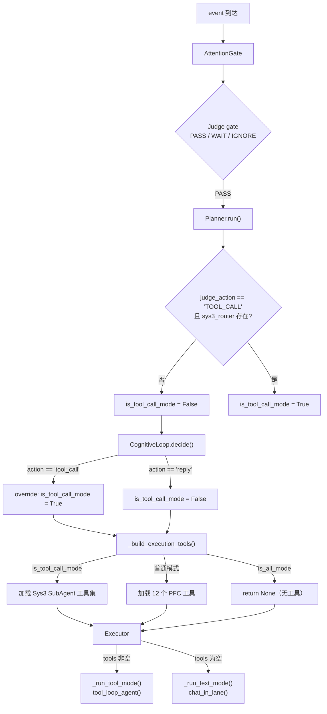

# Tool 调用机制深度分析报告

## 一、调用链路全景



## 二、发现的问题

---

### 问题 1（致命）：TOOL_CALL 入口被双重封死

#### 路径 A：Judge → TOOL_CALL

[planner.py L132-133](astrmai/conversation/planning/planner.py#L132-L133)

```python
judge_action = event.get_extra("judge_action", "REPLY")
is_tool_call_mode = (judge_action == "TOOL_CALL") and (self.sys3_router is not None)
```

但我们刚刚在注意力机制重构中把 Judge 限定为 **PASS / WAIT / IGNORE**：

[gate.py L616-619](astrmai/conversation/attention/gate.py#L616-L619)

```python
action = str(getattr(result, "action", "PASS") or "PASS").upper()
if action in {"WAIT", "IGNORE"}:
    return action
return "PASS"  # ← 所有非 WAIT/IGNORE 都映射为 PASS
```

> [!CAUTION]
> Judge 现在**永远不会返回 TOOL_CALL**。Planner L132 处 `judge_action` 始终是 `"PASS"`，所以 `is_tool_call_mode` 在 Judge 路径上**永远为 False**。

#### 路径 B：CognitiveLoop → tool_call

[planner.py L171-174](astrmai/conversation/planning/planner.py#L171-L174)

```python
if cognitive_decision.action == "tool_call" and self.sys3_router is not None:
    judge_action = "TOOL_CALL"
    event.set_extra("judge_action", judge_action)
    is_tool_call_mode = True
```

CognitiveLoop 可以产出 `action=tool_call`，但有 **3 重前置条件**必须同时满足：

| 条件 | 现实 |
|------|------|
| `self.cognitive_loop` 存在 | ⚠️ 取决于初始化 |
| `should_run()` 返回 True | ⚠️ 要求消息 ≥12 字或包含复杂性关键词 |
| LLM 在 2.5s 内返回合法 JSON 且 `action=="tool_call"` | ⚠️ 极难 |

**关键约束：**

[cognitive_loop.py L96-113](astrmai/conversation/planning/cognitive_loop.py#L96-L113)

```python
def should_run(self, event, prompt_envelope=None):
    if event.get_extra("astrmai_lightweight_event", False):
        return False
    if event.get_extra("is_fast_mode", False):
        return False
    # ... CORE_ONLY / ALL → False
    judge_action = str(event.get_extra("judge_action", "REPLY"))
    if judge_action in {"WAIT", "IGNORE", "TOOL_CALL"}:
        return False  # ← TOOL_CALL 跳过认知循环，但 TOOL_CALL 永远不出现
    # ...
    if len(current_text) >= 12:
        return True
    return any(token in current_text for token in self.COMPLEXITY_HINTS)
```

即使 `should_run=True`，CognitiveLoop 还有 **2.5s 超时**：

```python
return await asyncio.wait_for(
    self._decide_inner(...),
    timeout=self.SOFT_TIMEOUT_SECONDS,  # 2.5s
)
```

2.5s 内需要：
1. 一次 LLM JSON 调用（通常 1~3s）
2. 可能还有一次 readonly tool 调用 + 第二次 LLM JSON 调用

> **结论**：CognitiveLoop 大概率会超时或返回 `action=reply`，几乎不可能产出 `tool_call`。

---

### 问题 2：工具总是被加载，但 LLM 看不到任何工具提示

即使 12 个 PFC 工具被正确加载到 `tools` 列表，并通过 `tool_loop_agent()` 传入 AstrBot 框架——**LLM 自身的 system/user prompt 中没有任何提及工具的内容**。

当前 system_prompt 中：

- ✅ 有"我的表达底线"
- ✅ 有"内在驱动"
- ❌ **没有工具概览、工具使用指引、或"你可以调用以下工具"**

当前 user_prompt 中：

- ✅ 8 个 `---xxx---` 分区
- ❌ **没有工具提示分区**

> [!IMPORTANT]
> LLM 的 tool calling 能力依赖两个层面：
> 1. **API 层**：通过 `tools` 参数传入 function schema（已做到）
> 2. **Prompt 层**：在 system/user prompt 中提示"你可以使用工具"（**没有做到**）
>
> 很多 LLM（尤其是 chat-tuned 的）在没有 prompt 提示的情况下，即使 API 层注册了工具，也倾向于直接生成文本回复，而不会主动发起 function_call。

---

### 问题 3：ActionModifier 可能过度裁剪

[expression_policy.py L54-56](astrmai/conversation/planning/expression_policy.py#L54-L56)

```python
if state and hasattr(state, 'energy') and state.energy < self.ENERGY_EXHAUSTION:
    filtered = [t for t in filtered if getattr(t, 'name', '') in self.SURVIVAL_TOOLS]
```

当 `energy < 10` 时，**只保留 `wait_and_listen`**。其他 11 个工具全部被裁掉。

同样，`score < HOSTILE_THRESHOLD(-20)` 时只保留 3 个工具。

如果状态引擎返回了一个低 energy 或低 score，工具集直接退化为空壳。

---

### 问题 4：`is_all_mode` 时工具为 None

[planner_side_inputs.py L116-118](astrmai/conversation/planning/planner_side_inputs.py#L116-L118)

```python
if is_all_mode:
    self._set_disable_rag_injection(ctx, True)
    return None  # ← 无工具
```

`is_all_mode = "ALL" in retrieve_keys`。当 focus_event 不是 near_context_query 时，retrieve_keys 为 `["ALL"]`，触发 `is_all_mode=True` → tools=None → text_mode。

[gate.py L519](astrmai/conversation/attention/gate.py#L519)

```python
retrieve_keys = ["CORE_ONLY"] if focus_candidate.is_near_context_query else ["ALL"]
```

也就是说，**绝大多数正常消息** → `retrieve_keys=["ALL"]` → `is_all_mode=True` → **tools=None** → **text_mode**。

> [!CAUTION]
> 这是 tool 从不被调用的**最直接原因**：正常消息走 `ALL` 模式，而 `ALL` 模式直接返回 `tools=None`。

---

### 问题 5：`is_fast_mode` 也禁止 RAG 但仍加载工具

[planner_side_inputs.py L159](astrmai/conversation/planning/planner_side_inputs.py#L159)

```python
self._set_disable_rag_injection(ctx, is_fast_mode)
```

fast_mode 下 RAG 被禁用但工具仍被加载（不返回 None）。不过 fast_mode 只在 `CORE_ONLY` 和 lightweight_event 时触发。

---

## 三、问题总结

| # | 问题 | 层级 | 严重度 | 后果 |
|---|------|------|--------|------|
| 1 | Judge 不再返回 TOOL_CALL | 决策层 | 🔴 | TOOL_CALL 入口被封死 |
| 2 | Prompt 中无工具提示 | 认知层 | 🔴 | LLM 不知道可以调工具 |
| 3 | `is_all_mode` → tools=None | 执行层 | 🔴 | 正常消息的 tools 永远为空 |
| 4 | CognitiveLoop 2.5s 超时 | 决策层 | 🟡 | tool_call 决策几乎不可达 |
| 5 | ActionModifier 低能量裁剪 | 执行层 | 🟡 | 工具可能被裁到只剩 wait |

### 实际执行链路

```
正常消息 → retrieve_keys=["ALL"] → is_all_mode=True
    → _build_execution_tools return None
    → executor: tools is None
    → _run_text_mode()  ← 纯文本，无 tool
```

```
near_context_query → retrieve_keys=["CORE_ONLY"] → is_fast_mode=True
    → 加载 12 个工具，但 CognitiveLoop 跳过
    → executor: tools 有值
    → _run_tool_mode()  ← 有工具，但 LLM 没被提示使用
```

**结论**：正常消息走 `is_all_mode` 时工具直接被清空；少数走 `CORE_ONLY` 的消息虽然有工具，但 prompt 中没有任何使用提示，LLM 也几乎不会主动调用。

---

## 四、修复方向建议

### 优先级 1：打通 tools=None 的瓶颈

`is_all_mode` 不应该直接 `return None`。正常消息也应该有工具可用。

```diff
 if is_all_mode:
     self._set_disable_rag_injection(ctx, True)
-    return None
+    # 正常消息也加载基础工具集
```

### 优先级 2：在 prompt 中加入工具意识

在 system_prompt（`_system_rules_block` 或 `_build_behavior_rule_block`）中追加工具提示：

```
我手边有一些可用的动作：查记忆、戳人、发表情包、@人、转移话题等。
如果觉得当前场景适合用，我会自然地使用它们，不需要等指令。
```

### 优先级 3：恢复或简化 tool_call 决策

方案 A：让 CognitiveLoop 更容易产出 `tool_call`（降低超时、简化 JSON schema）

方案 B：在 Planner 层直接根据消息内容做轻量 tool_call 预判（基于关键词/意图）：

```python
# 如果用户说"帮我查/搜一下/你还记得..." → 开启 tool_call_mode
tool_trigger_keywords = ["帮我", "搜一下", "查一下", "你记得", "你还记得"]
if any(kw in msg_str for kw in tool_trigger_keywords):
    is_tool_call_mode = True
```

### 优先级 4：ActionModifier 加兜底

即使 energy 极低，也至少保留 `omni_perception_query` 和 `self_lore_query` 这类纯查询工具。

---

## Open Questions

> [!IMPORTANT]
> **Q1**：`is_all_mode` 时 tools 设为 None 是否是有意的设计？还是历史遗留？如果是有意的（为了避免 ALL 模式下 tool_loop 增加延迟），是否可以改为"加载但标记为 passive"？
>
> **Q2**：CognitiveLoop 的 2.5s 超时是否应该放宽到 4~5s？还是应该让 tool_call 决策不依赖 CognitiveLoop，而是在 Planner 层做轻量关键词预判？
>
> **Q3**：prompt 中的工具提示应该放在 system_prompt（跨轮可缓存）还是 user_prompt 的 `---本轮指引---`（每轮构建）？放在 system_prompt 会增加 token 缓存大小，但 LLM 更容易注意到。
